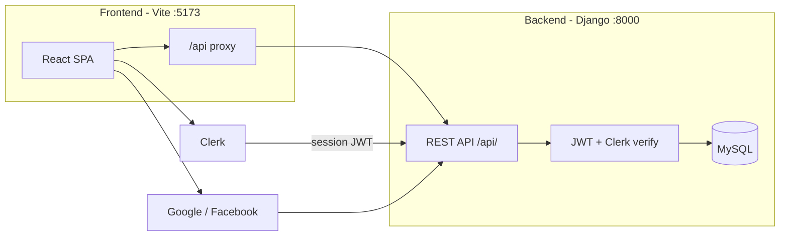

# NextCRM

A full-stack customer relationship management (CRM) application for managing leads, tasks, and notes, with role-based access control, dashboard analytics, and flexible authentication (email/password, Clerk, and optional OAuth).

## Table of contents

- [Features](#features)
- [Tech stack](#tech-stack)
- [Architecture](#architecture)
- [Prerequisites](#prerequisites)
- [Project structure](#project-structure)
- [Quick start](#quick-start)
- [Environment variables](#environment-variables)
- [Authentication](#authentication)
- [API overview](#api-overview)
- [Development](#development)
- [Production](#production)
- [Further documentation](#further-documentation)

## Features

- **Lead management** — Create, update, filter, and export leads with status, source, estimated value, and contact history.
- **Tasks** — Kanban-style task board linked to CRM workflow.
- **Notes** — Attach notes to leads for activity tracking.
- **Dashboard** — Overview statistics and charts for pipeline visibility.
- **User roles** — `ADMIN` and `AGENT` roles with route-level and API-level enforcement.
- **Admin tools** — Team management, system audit logs, settings, and CSV lead export (admin only).
- **Multiple sign-in options**
  - Email/password with JWT (Simple JWT)
  - [Clerk](https://clerk.com/) session exchange for hosted auth UI
  - Optional Google and Facebook OAuth

## Tech stack

| Layer    | Technologies |
|----------|--------------|
| Frontend | React 19, Vite 8, Redux Toolkit (RTK Query), React Router 7, Tailwind CSS 4, Recharts, Clerk React |
| Backend  | Django 5, Django REST Framework, Simple JWT, PyMySQL, django-cors-headers |
| Database | MySQL 5.7+ / 8.x |

## Architecture



In local development, the Vite dev server proxies `/api` requests to the Django backend (`http://127.0.0.1:8000`), so the frontend can call the API on the same origin without CORS issues for API routes.

## Prerequisites

- **Node.js** 18+ (20+ recommended) and npm
- **Python** 3.10+ (3.12 recommended)
- **MySQL** 5.7+ or 8.x with an empty database created for the app
- **MySQL client libraries** on the host (for PyMySQL / `cryptography`)

Optional, depending on features you enable:

- [Clerk](https://clerk.com/) application (for Clerk sign-in)
- Google Cloud / Facebook Developer credentials (for OAuth)

## Project structure

```
CRM/
├── backend/          # Django REST API
│   ├── api/          # Models, serializers, views, auth, OAuth
│   ├── core/         # Settings, root URLs, WSGI/ASGI
│   ├── manage.py
│   ├── requirements.txt
│   ├── .env.example
│   └── README.md     # Backend-specific setup and API details
├── frontend/         # React + Vite SPA
│   ├── src/
│   ├── package.json
│   └── README.md
└── README.md         # This file
```

## Quick start

Run the backend and frontend in **two separate terminals**.

### 1. Backend

```bash
cd backend

# One-time setup
python3 -m venv .venv
source .venv/bin/activate          # Windows: .venv\Scripts\activate
pip install -r requirements.txt
cp .env.example .env               # Edit MySQL and auth settings
python manage.py migrate
python manage.py createsuperuser   # Optional: Django admin at /admin/

# Start API server
python manage.py runserver
```

API base URL: **http://127.0.0.1:8000/**  
Health check: `GET http://127.0.0.1:8000/api/health/`

### 2. Frontend

```bash
cd frontend

# One-time setup
npm install

# Optional: Clerk (create frontend/.env.local)
# VITE_CLERK_PUBLISHABLE_KEY=pk_test_...

# Start dev server
npm run dev
```

App URL: **http://localhost:5173** (Vite default)

### 3. Verify

1. Open http://localhost:5173
2. Register or sign in (email/password and/or Clerk, if configured)
3. Confirm `GET /api/health/` returns OK from the backend

## Environment variables

### Backend (`backend/.env`)

Copy from `backend/.env.example`. Key variables:

| Variable | Required | Description |
|----------|----------|-------------|
| `DJANGO_SECRET_KEY` | Production | Django secret key and signing |
| `DJANGO_DEBUG` | — | `true` for local dev, `false` in production |
| `DJANGO_ALLOWED_HOSTS` | Production | Comma-separated hostnames |
| `MYSQL_DATABASE` | Yes | MySQL database name |
| `MYSQL_USER` | Yes | MySQL user |
| `MYSQL_PASSWORD` | Yes | MySQL password |
| `MYSQL_HOST` | — | Default `127.0.0.1` |
| `MYSQL_PORT` | — | Default `3306` |
| `CLERK_JWKS_URL` | For Clerk | Clerk JWKS URL for JWT verification |
| `CLERK_ISSUER` | For Clerk | Expected JWT issuer(s), comma-separated if needed |
| `CLERK_AUDIENCE` | Optional | Match JWT `aud` when present |
| `BOOTSTRAP_ADMIN_EMAILS` | Optional | Emails that receive `ADMIN` on first email registration |
| `BOOTSTRAP_ADMIN_CLERK_IDS` | Optional | Clerk user IDs (`sub`) that receive `ADMIN` on first sync |
| `OAUTH_FRONTEND_CALLBACK_URL` | OAuth | Frontend OAuth callback (default `http://localhost:5173/oauth/callback`) |
| `GOOGLE_OAUTH_*` | OAuth | Google client ID, secret, redirect URI |
| `FACEBOOK_*` | OAuth | Facebook app ID, secret, redirect URI |

### Frontend (`frontend/.env.local`)

| Variable | Required | Description |
|----------|----------|-------------|
| `VITE_CLERK_PUBLISHABLE_KEY` | For Clerk UI | Publishable key from Clerk Dashboard (same app as backend JWKS) |

Vite loads variables prefixed with `VITE_`. Restart the dev server after changing env files.

## Authentication

All protected API routes expect:

```http
Authorization: Bearer <access_token>
```

Tokens are issued by the backend (Simple JWT) after successful login.

| Method | Flow |
|--------|------|
| **Email/password** | `POST /api/auth/register/` → `POST /api/auth/token/` → use access token; refresh via `POST /api/auth/token/refresh/` |
| **Clerk** | Sign in with Clerk in the UI → frontend sends Clerk session JWT to `POST /api/auth/clerk-token/` → API returns CRM access/refresh tokens |
| **OAuth** | `GET /api/auth/oauth/providers/` → Google/Facebook start URLs → callback → tokens; frontend handles `/oauth/callback` |

If Clerk is not configured on the backend, `POST /api/auth/clerk-token/` returns **503** with a clear message.

**Roles:** `ADMIN` users can access team management, system logs, settings, and lead export. `AGENT` users have standard CRM access.

## API overview

Base path: **`/api/`**

| Area | Examples |
|------|----------|
| Health | `GET /api/health/` |
| Auth | `/api/auth/register/`, `/api/auth/token/`, `/api/auth/token/refresh/`, `/api/auth/clerk-token/` |
| OAuth | `/api/auth/oauth/providers/`, Google/Facebook start and callback |
| User | `GET /api/me/` |
| CRM | `/api/leads/`, `/api/tasks/`, `/api/notes/` |
| Dashboard | `GET /api/dashboard/stats/` |
| Admin | `/api/admin/users/`, `/api/admin/logs/`, `/api/admin/export/leads/` |

Pagination: default page size **25**, max **100** (`?page=` and `?page_size=`).

Django admin: **http://127.0.0.1:8000/admin/** (requires `createsuperuser`).

## Development

### Useful commands

**Backend** (from `backend/`, venv active):

```bash
python manage.py makemigrations
python manage.py migrate
python manage.py check
python manage.py test
python manage.py runserver 0.0.0.0:8000   # Listen on all interfaces
```

**Frontend** (from `frontend/`):

```bash
npm run dev      # Development server with HMR
npm run build    # Production build → dist/
npm run preview  # Preview production build
npm run lint     # ESLint
```

### CORS and proxy

- Vite proxies `/api` → `http://127.0.0.1:8000` (see `frontend/vite.config.js`).
- Django allows credentialed CORS from `http://localhost:5173` and `http://127.0.0.1:5173`. Add other origins in `backend/core/settings.py` if needed.

### Default ports

| Service   | URL |
|-----------|-----|
| Frontend  | http://localhost:5173 |
| Backend   | http://127.0.0.1:8000 |
| MySQL     | 127.0.0.1:3306 |

## Production

- Set `DJANGO_DEBUG=false`, a strong `DJANGO_SECRET_KEY`, and correct `DJANGO_ALLOWED_HOSTS`.
- Serve the API with a production WSGI/ASGI server (e.g. Gunicorn) behind HTTPS and a reverse proxy.
- Build the frontend (`npm run build`) and serve static files from `frontend/dist/` via your web server or CDN.
- Point the frontend API base URL at your deployed backend (configure proxy or `VITE_*` API URL if you add one).
- Align Clerk, OAuth redirect URIs, and `OAUTH_FRONTEND_CALLBACK_URL` with your production domain.
- Never commit `.env` files or real credentials to version control.

## Further documentation

- [backend/README.md](backend/README.md) — Detailed backend setup, env reference, and API layout
- [frontend/README.md](frontend/README.md) — Vite/React template notes

## License

Add your license here if applicable.
